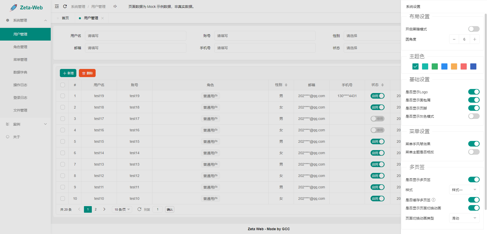
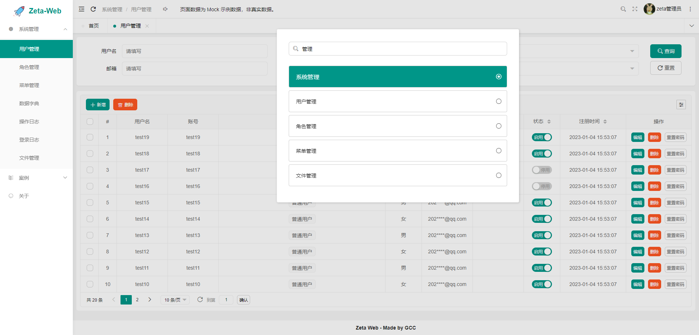
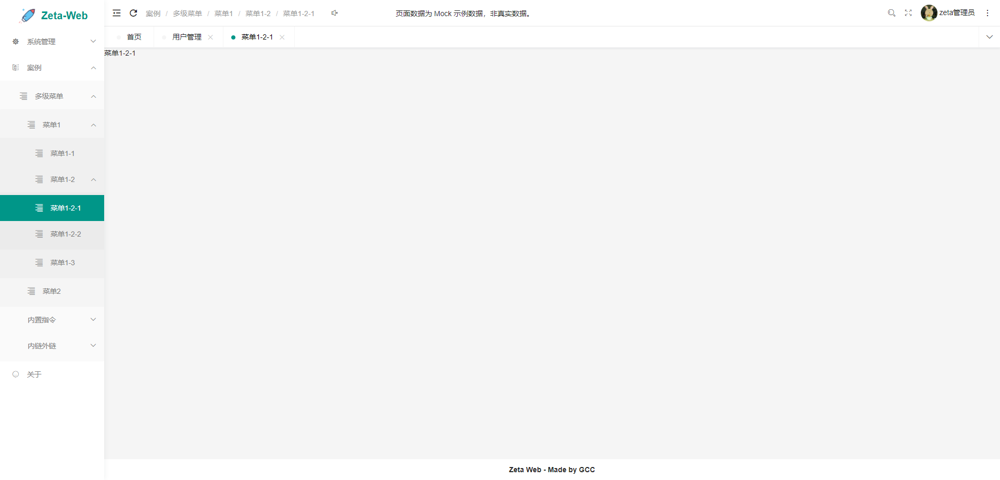

# zeta-web-layui

## 简介

zeta-web-layui是一个基于Vue3、Vite5、Pinia、TypeScript、layui-vue开发的项目脚手架。

本项目只提供了一个最基础的RBAC用户角色权限功能。不像其它开源项目那样大而全，本项目相当精简。

## 如何启动

本项目推荐使用yarn, 当然您用其它的也可以

```bash
yarn install
yarn run serve

# 通过VITE_CJS_TRACE=true标志排查cjs 
# https://cn.vitejs.dev/guide/troubleshooting#vite-cjs-node-api-deprecated
yarn run dev
```

## 技术选型

| 技术         | 说明                                        |
|------------|-------------------------------------------|
| vue3       | 核心框架                                      |
| typescript | 开发语言                                      |
| layui-vue  | [ui框架](https://gitee.com/layui/layui-vue) |
| nodejs     | `>=18.0.0`                                  |


## 后端

| 名称                  | 说明                                  | 项目地址                                                     |
| --------------------- | ------------------------------------- | ------------------------------------------------------------ |
| zeta-kotlin | 本项目后端 | [gitee](https://gitee.com/xia5800/zeta-kotlin)  [github](https://github.com/xia5800/zeta-kotlin) |
| zeta-kotlin-generator | 专门为zeta-kotlin项目定做的代码生成器 | [gitee](https://gitee.com/xia5800/zeta-kotlin-generator)  [github](https://github.com/xia5800/zeta-kotlin-generator) |
| zeta-kotlin-module    | zeta-kotlin项目多模块版              | [gitee](https://gitee.com/xia5800/zeta-kotlin-module) [github](https://github.com/xia5800/springboot-kotlin-module)|

## 已有功能

- 用户管理
- 角色管理
- 菜单管理
- 操作日志
- 登录日志
- 数据字典
- 文件管理

## 常见问题

[常见问题及解决方法.md](./_docs/常见问题及解决方法.md)

## 友情链接 & 特别鸣谢

- layui-vue：[https://gitee.com/layui/layui-vue](https://gitee.com/layui/layui-vue)
- layui-vue-admin: [https://gitee.com/layui-vue/layui-vue-admin](https://gitee.com/layui-vue/layui-vue-admin)
- parfait [https://github.com/cosmoscatts/parfait](https://github.com/cosmoscatts/parfait)
- zeta-kotlin：[https://gitee.com/xia5800/zeta-kotlin](https://gitee.com/xia5800/zeta-kotlin)

## 项目截图






